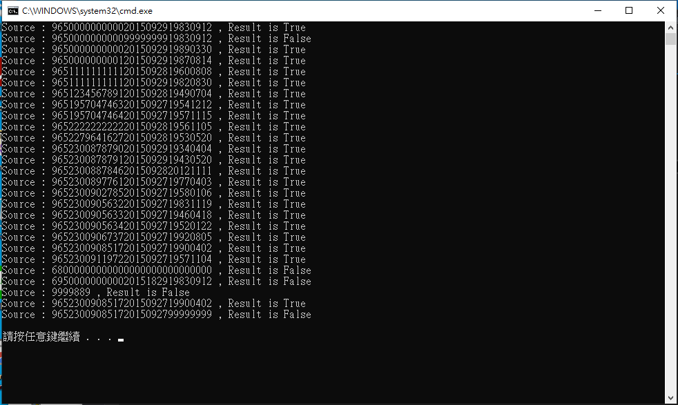

# CommandSamples

## 概觀
* 目的：將一個請求封裝成一個物件，讓你能夠使用各種不同的訊息、
佇列、紀錄以及支援復原功能加以參數化。 
* 將命令的請求方與執行方解耦。 

## 角色扮演
* Command  
    * 定義一個執行命令的抽象介面，通常為interface 或abstract class。
* ConcreteCommand
    * 繫結對應的操作與Receiver(接收者，也就是真正執行命令的角色)
    * 實作執行命令的程式(圖中的Execute method)，呼叫Receiver 執行對應
的操作。  
* Receiver
    * 真正執行命令的角色，了解如何依照收到的訊息執行命令。
    * 可以是任何的類別，不一定有抽象的需要。
* Invoker
    * 指揮Command 執行命令。
* 依序執行多個命令
    * 前述的Invoker 內部是單一個Command 型別欄位(屬性)，呼叫
Action method 只能執行一個Command。
    * 若改為集合，就可以讓Invoker 一次執行多個命令。

## 驗證需求：  
* 總長需為29
* index 0~2 需為965
* index 13~20 需為日期格式
* index 21~28 需為日期格式

結果如下

